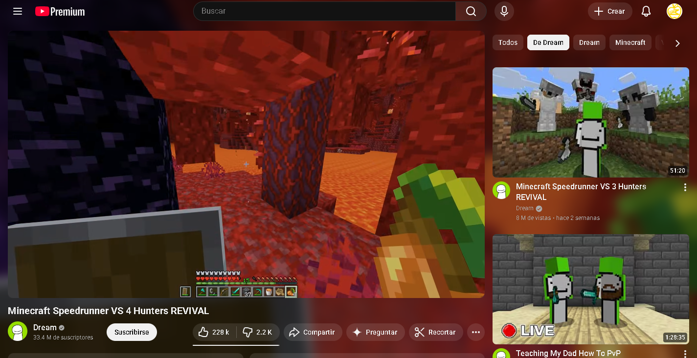
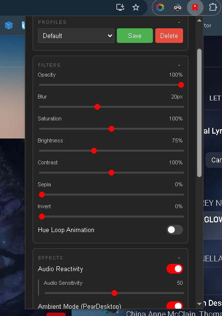

  

  # ReflecTube

  **Transform Your YouTube Experience with Immersive Reflections & Visuals**

  
  
  

  

    <a href="#features">Features</a> •
    <a href="#installation">Installation</a> •
    <a href="#configuration">Configuration</a> •
    <a href="#contributing">Contributing</a>
  

---

## 🚀 Overview

**ReflecTube** brings a new dimension to your YouTube watching experience. It creates a dynamic, real-time reflection of the video player, adding depth and atmosphere to your browser. With advanced features like reactive audio visualizers, ambient lighting modes, and customizable filters, standard viewing becomes an immersive event.

Works on **YouTube** and **YouTube Music**.

## ✨ Key Features

| Feature | Description |
| :--- | :--- |
| **📺 Real-time Reflection** | Mirrors the YouTube video player in a customizable canvas behind the video. |
| **💡 Ambient Mode** | "PearDesktop" style ambient lighting that glows and reacts to the video content. |
| **🔊 Audio Reactivity** | Visuals that dance to the beat! Includes a frequency visualizer and camera shake effects. |
| **🎨 Deep Customization** | Adjust Blur, Opacity, Saturation, Contrast, Brightness, Sepia, Sharpness, Highlights & Shadows. |
| **🖌️ Filters & Effects** | Apply Invert, Grayscale, Hue Loop animation, and more. |
| **🎬 Filter Presets** | One-click presets: Cinema, Neon, Vintage, Lo-fi, and RGB/Rainbow. |
| **✂️ Letterbox Crop** | Real-time black bar detection and removal for the canvas reflection and the video player (beta — consensus-based stable detection). |
| **🖱️ Interactive** | The reflection follows your mouse pointer movements for a parallax-like effect. |
| **💾 Platform Profiles** | Separate profiles for YouTube and YouTube Music. Save, load, export and import configurations. Auto-save keeps your active profile up to date. |
| **⚡ WebGL Support** | Experimental GPU acceleration for advanced liquid distortion effects. |
| **📊 FPS Monitor** | Real-time performance counter with color-coded badge (green/yellow/red). |
| **🔔 Update Badge** | Red notification dot on the extension icon when a new version is available. |
| **🌐 Multi-language** | English, Spanish, Portuguese, French, German and Japanese. |

---

## 📸 Screenshots

  
  
<i>The classic reflection mode</i>

   
  
  
  
<i>Extensive configuration options and Ambient Mode</i>

---

## 📥 Installation

### Developer Mode (From Source)

1.  Clone or download this repository.
2.  Open **Chrome** (or any Chromium-based browser like Edge/Brave).
3.  Navigate to `chrome://extensions/`.
4.  Toggle **Developer mode** in the top right corner.
5.  Click **Load unpacked**.
6.  Select the `Reflectube` folder you downloaded.
7.  Success! Go to YouTube and enjoy.

---

## ⚙️ Configuration

Open the ReflecTube popup by clicking the extension icon in your toolbar.

### 🎛️ Sections

| Section | What's inside |
| :--- | :--- |
| **Filters** | Opacity, Blur, Saturation, Brightness, Contrast, Sepia, Invert, Sharpness, Highlights, Shadows, Hue Loop. Plus a **Preset** dropdown (Cinema, Neon, Vintage, Lo-fi, RGB). |
| **Effects** | Audio Reactivity & Sensitivity, Camera Shake & Intensity, Audio Visualizer (Bars / Soundwave / Ocean / Bubbles), Pointer Follow, WebGL, Ambient Mode & Scale, Music-Only toggle. |
| **System** | Frame Rate, Smoothness, Resolution, **Crop Canvas** (letterbox), **Crop Video** (letterbox), FPS badge. |
| **Profiles** | Create, save, delete, export & import profiles. Profiles are separated per platform (YouTube vs YouTube Music). Changes auto-save to the active profile. |

### 🎚️ Fine Tuning
*   **Frame Rate:** Controls the smoothness and performance of the reflection (ms between frames).
*   **Blur & Opacity:** Define how subtle or distinct the reflection is.
*   **Audio Sensitivity:** Calibrate how much the visuals react to sound.
*   **Crop Canvas / Crop Video:** Auto-detect and remove horizontal black bars (letterboxing) in real time.

---

## 🌐 Supported Languages

| Language | Locale |
| :--- | :--- |
| English | `en` |
| Español | `es` |
| Português | `pt` |
| Français | `fr` |
| Deutsch | `de` |
| 日本語 | `ja` |

---

## 🤝 Contributing

Contributions are welcome! Whether it's reporting a bug, suggesting a feature, or writing code.

1.  Fork the Project
2.  Create your Feature Branch (`git checkout -b feature/AmazingFeature`)
3.  Commit your Changes (`git commit -m 'Add some AmazingFeature'`)
4.  Push to the Branch (`git push origin feature/AmazingFeature`)
5.  Open a Pull Request

## 👤 Author

**Manzbot & Community**

---

  Built with ❤️ for the YouTube Community

